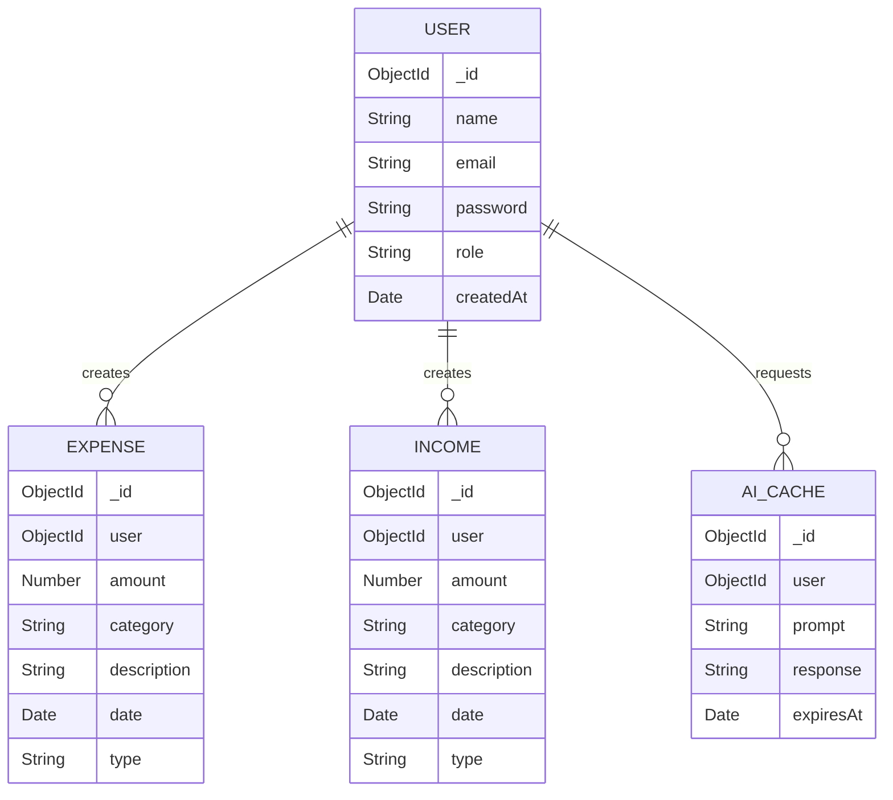
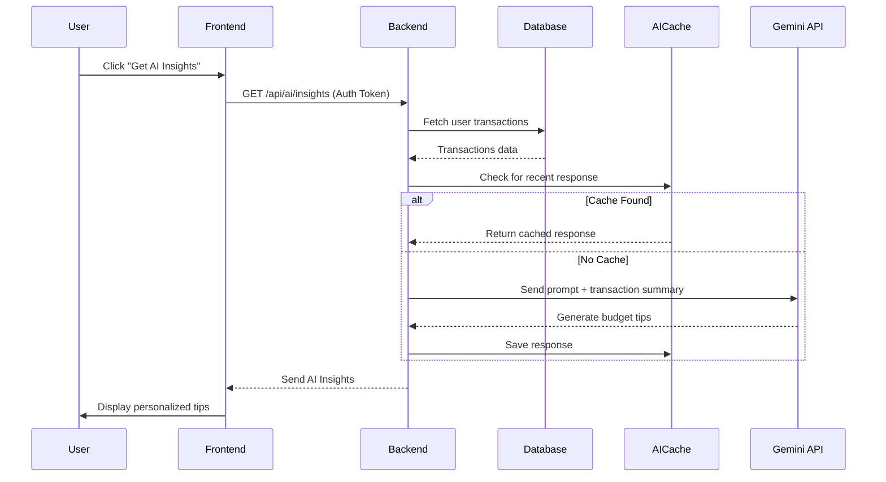

# System Design Documentation
# ExpenseAI - Personal Expense & Income Tracker with AI Analytics

## 1. Entity Relationship Diagram (ERD)



## 2. Use Case Diagram

```
                    ┌──────────────────┐
                    │   Guest User     │
                    └────────┬─────────┘
                             │
                    ┌────────▼─────────┐
                    │  Register        │
                    │  Login           │
                    │  View Landing    │
                    └──────────────────┘

    ┌──────────────────┐
    │ Authenticated    │
    │     User         │
    └────────┬─────────┘
             │
    ┌────────▼──────────────────────────┐
    │                                    │
    │  • View Dashboard Overview        │
    │  • Manage Expenses (CRUD)         │
    │  • Manage Incomes (CRUD)          │
    │  • View Spending Analytics        │
    │  • Get AI Budget Insights         │
    │  • Compare Income vs Expenses     │
    │  • Filter Transactions by Date    │
    │  • Update User Profile            │
    │  • Logout                         │
    │                                    │
    └───────────────────────────────────┘
```

## 3. System Architecture Diagram

```
┌─────────────────────────────────────────────────────────────┐
│                        CLIENT LAYER                          │
│  ┌──────────────────────────────────────────────────────┐   │
│  │          React + TypeScript Frontend                  │   │
│  │  ┌────────────┐  ┌────────────┐  ┌────────────┐     │   │
│  │  │   Pages    │  │ Components │  │   Redux    │     │   │
│  │  │            │  │            │  │   Store    │     │   │
│  │  └────────────┘  └────────────┘  └────────────┘     │   │
│  │                                                        │   │
│  │  TailwindCSS • Redux Toolkit • Axios • Recharts      │   │
│  └──────────────────────────────────────────────────────┘   │
└─────────────────────────┬───────────────────────────────────┘
                          │ HTTPS/REST API
                          │
┌─────────────────────────▼───────────────────────────────────┐
│                    API GATEWAY LAYER                         │
│  ┌──────────────────────────────────────────────────────┐   │
│  │         Express.js + TypeScript Backend              │   │
│  │                                                        │   │
│  │  ┌──────────┐  ┌──────────┐  ┌──────────┐           │   │
│  │  │  Routes  │→ │Controllers│→ │ Services │           │   │
│  │  └──────────┘  └──────────┘  └──────────┘           │   │
│  │                                       │                │   │
│  │  ┌──────────────────────┐             │                │   │
│  │  │   Middleware Layer   │             ▼                │   │
│  │  │  • JWT Auth          │      ┌──────────────┐        │   │
│  │  │  • Rate Limiting     │      │  Gemini AI   │        │   │
│  │  │  • Error Handling    │      │ Integration  │        │   │
│  │  └──────────────────────┘      └──────────────┘        │   │
│  └──────────────────────────────────────────────────────┘   │
└──────────────┬─────────────────────────────┬────────────────┘
               │ Mongoose ODM                │
               │                             │
┌──────────────▼─────────────┐ ┌─────────────▼────────────────┐
│      DATABASE LAYER        │ │      EXTERNAL SERVICES       │
│  ┌──────────────────────┐  │ │  ┌──────────────────────┐   │
│  │   MongoDB Atlas      │  │ │  │   Google Gemini API  │   │
│  │  (Collections)       │  │ │  │ (AI Budget Insights) │   │
│  └──────────────────────┘  │ │  └──────────────────────┘   │
└────────────────────────────┘ └──────────────────────────────┘
```

## 4. Folder Structure

### Frontend Structure
```
frontend/
├── src/
│   ├── components/
│   │   ├── common/          # Button, Card, Loader, Toast
│   │   ├── layout/          # Navbar, Sidebar
│   │   ├── expenses/        # Expense components
│   │   ├── income/          # Income components
│   │   └── charts/          # Analytics visualizations
│   ├── pages/               # Landing, Login, Dashboard, Analytics
│   ├── store/               # Redux Slices (auth, expense, income, ai, analytics)
│   ├── services/            # API Services (auth, api)
│   ├── hooks/               # Custom hooks (useAuth, useToast)
│   ├── types/               # TypeScript interfaces
│   └── utils/               # Formatter, constants
```

### Backend Structure
```
backend/
├── src/
│   ├── models/              # User, Expense, Income, AICache
│   ├── controllers/         # Auth, Expense, Income, AI, Analytics
│   ├── routes/              # API route definitions
│   ├── services/            # aiService.ts (Gemini integration)
│   ├── middleware/          # Auth, Error, Rate limiter
│   ├── config/              # Database & Env config
│   └── server.ts            # Entry point
```

## 5. API Endpoints Documentation

### Authentication
```
POST   /api/auth/register    - Create new account
POST   /api/auth/login       - Authenticate user
GET    /api/auth/me          - Get current user profile
PUT    /api/auth/profile     - Update profile info
```

### Expenses (CRUD)
```
GET    /api/expenses         - Get user expenses (paginated)
POST   /api/expenses         - Add new expense
PUT    /api/expenses/:id     - Update expense
DELETE /api/expenses/:id     - Remove expense
```

### Incomes (CRUD)
```
GET    /api/incomes          - Get user incomes
POST   /api/incomes          - Add new income
PUT    /api/incomes/:id      - Update income
DELETE /api/incomes/:id      - Remove income
```

### AI & Analytics
```
GET    /api/ai/insights      - Get AI-powered financial tips
GET    /api/analytics/stats  - Get summary stats (total income/expense)
GET    /api/analytics/charts - Get data formatted for Recharts
```

## 6. Sequence Diagrams

### AI Insights Generation


## 7. Redux State Management

- **authSlice**: Manages user session, tokens, and authentication status.
- **expenseSlice**: Manages list of expenses, loading states, and pagination.
- **incomeSlice**: Manages list of incomes and transaction status.
- **aiSlice**: Handles AI generated insights and generation status.
- **analyticsSlice**: Aggregates data for charts and dashboard stats.
- **uiSlice**: Global UI state (sidebar, theme, toast notifications).

## 8. Development & Deployment

- **Version Control**: Git/GitHub with feature branch workflow.
- **Frontend Deployment**: Host on Vercel with HTTPS enabled.
- **Backend Deployment**: Host on Render with environment variable management.
- **Database**: Dedicated MongoDB Atlas cluster for data persistence.
- **Security**: JWT implementation, password hashing, and CORS protection.
